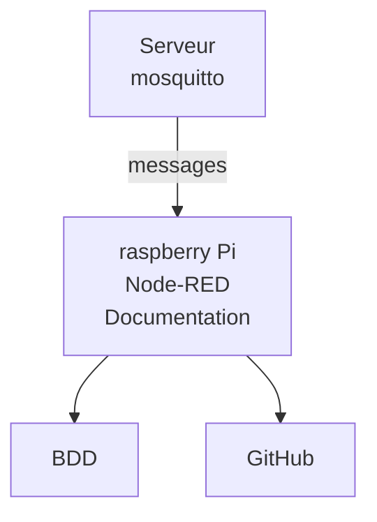

# test-univ-tours

Projet test pour montrer l'utilisation

&nbsp;	ce que le projet va permettre : 

&nbsp;	- Récuperer des messages

&nbsp;	- les stocker en BDD

&nbsp;	- les affihcer

&nbsp;	- utiliser node-RED

